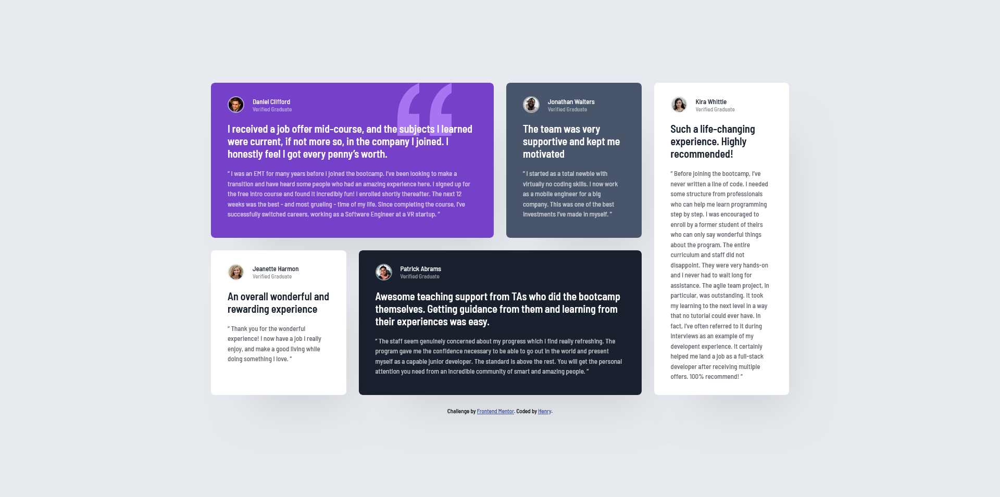

# Testimonials grid section solution

This is a solution to the [Testimonials grid section challenge on Frontend Mentor](https://www.frontendmentor.io/challenges/testimonials-grid-section-Nnw6J7Un7).

## Table of contents

- [Overview](#overview)
  - [The challenge](#the-challenge)
  - [Screenshot](#screenshot)
  - [Links](#links)
- [My process](#my-process)
  - [Built with](#built-with)
  - [What I learned](#what-i-learned)
  - [Continued development](#continued-development)
  - [Useful resources](#useful-resources)  
- [Author](#author)

## Overview

### The challenge

Users should be able to:

- View the optimal layout for the site depending on their device's screen size

### Screenshot



### Links

- Solution URL: [https://github.com/Henrydevlab/testimonials-grid-section](https://github.com/Henrydevlab/testimonials-grid-section)
- Live Site URL: [https://henrydevlab.github.io/testimonials-grid-section/](https://henrydevlab.github.io/testimonials-grid-section/)

## My process

### Built with

- Semantic HTML5 markup
- CSS custom properties
- Flexbox
- CSS Grid
- Mobile-first workflow

### What I learned

During this project, I focused on translating static mockups into a highly scalable, fluid, and responsive dashboard grid. I learned how to handle complex layout mappings efficiently using CSS Grid Area templates, which allowed the codebase to shift cleanly from a mobile single-column view to an asymmetric 4-column layout on desktop monitors.

Below is the desktop grid-area orchestration used to map the layout perfectly to the reference designs:

```css
@media (min-width: 1100px) {
  .testimonial-grid {
    grid-template-columns: repeat(4, 1fr);
    grid-template-areas: 
      "daniel daniel jonathan kira"
      "jeanette patrick patrick kira";
  }

  .card:nth-child(1) { grid-area: daniel; }
  .card:nth-child(2) { grid-area: jonathan; }
  .card:nth-child(3) { grid-area: jeanette; }
  .card:nth-child(4) { grid-area: patrick; }
  .card:nth-child(5) { grid-area: kira; }
}
```

### Continued development

In upcoming front-end engineering challenges, I intend to refine my competencies in the following core areas:

- Core Web Vitals Optimization: Deepening my understanding of asset loading pipelines to minimize layout shifts on slower networks.
- Advanced Assistive Technologies (A11y): Further exploring micro-layouts utilizing hidden landmarks to enrich screen-reader flows on non-standard components.

### Useful resources

- [MDN Web Docs : Grid Layout](https://developer.mozilla.org/en-US/docs/Web/CSS/Guides/Grid_layout) - Crucial documentation for mastering complex area spanning and structural logic.

## Author

- Frontend Mentor - [@henrydevlab](https://www.frontendmentor.io/profile/henrydevlab)
- Twitter - [@henrydevlab](https://www.twitter.com/henrydevlab)
